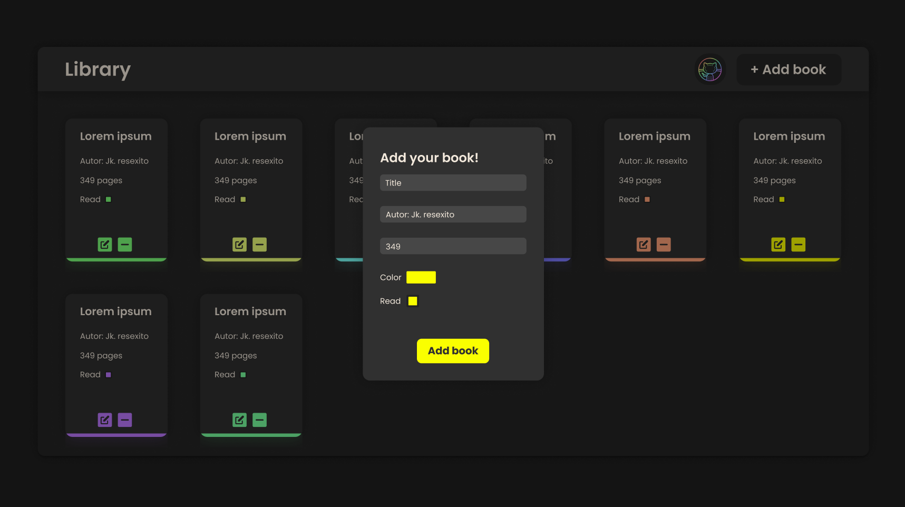
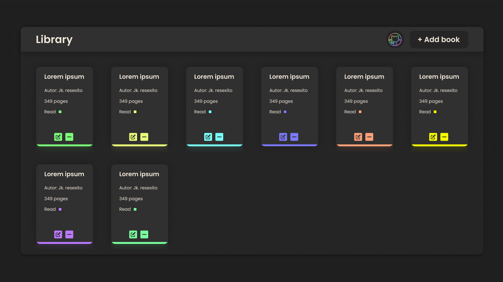

# book_library

In this project i made a book library. It is a simple application that allows you to add books. 

Acquired knowledge: 
● How stop an event from default action 
● A more deeper use and understanding for grids 
● Make object constructors 

images preview: 
 
 

